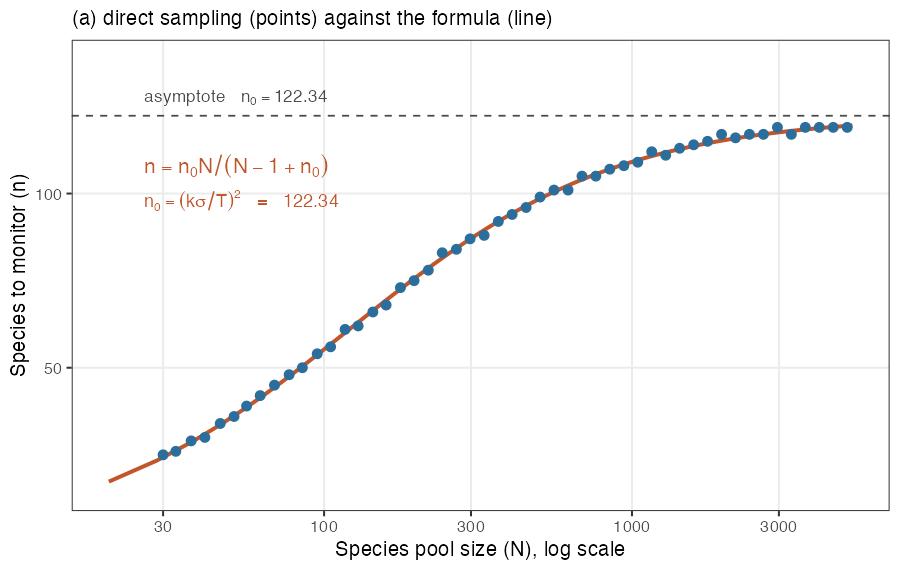
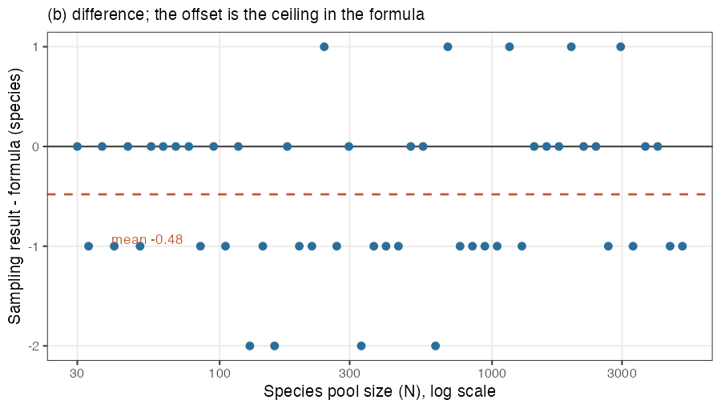
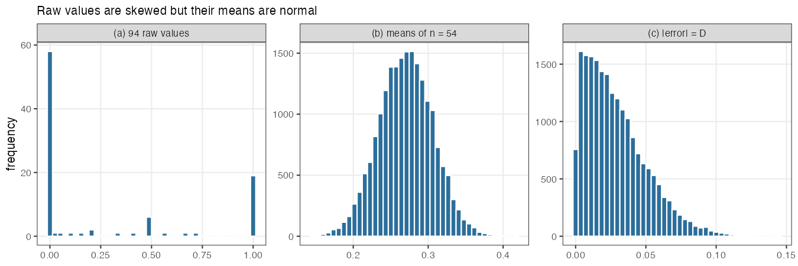
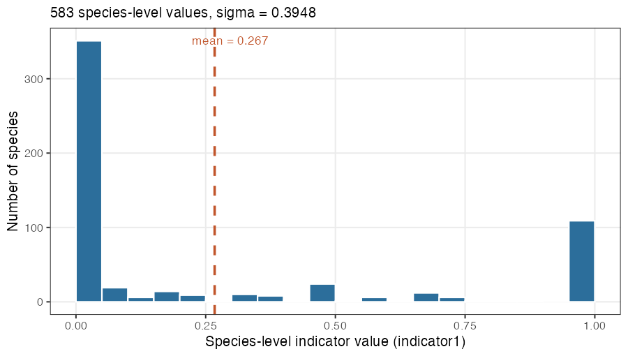
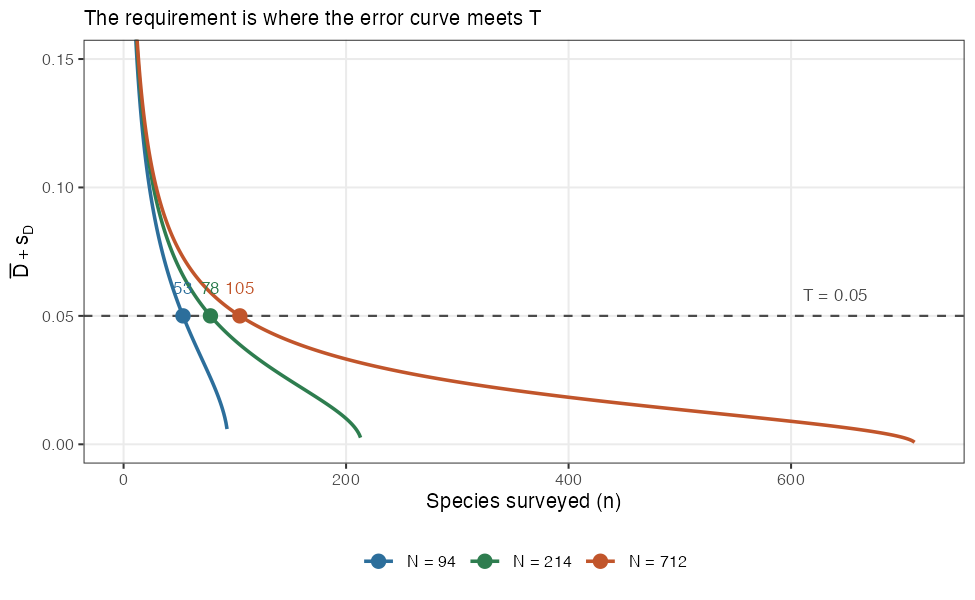
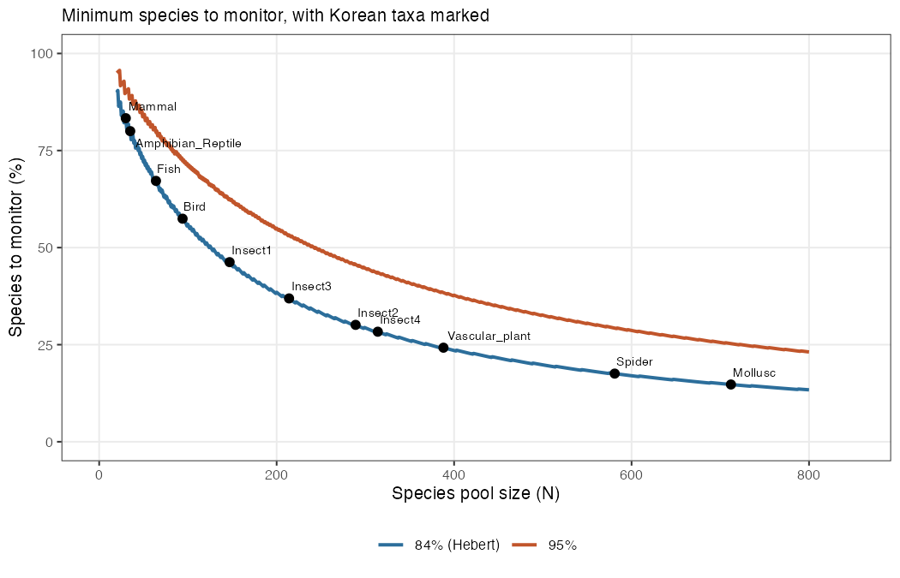

# Ne500 minimum species

**How many species must a country monitor to report the CBD Headline Indicator
A.4 — *the proportion of populations with an effective population size greater
than 500* — at an acceptable level of accuracy?**

Hebert et al. (2026) is currently the only paper that presents that range. We then felt the need to 
present a mathematical formula that corroborates with the authors' approach and can return a continuous number(n; minimum species number) from the total species size (N).
So the purpose of this github is to present a formula you can quickly use to get the n, from your N. 
N is usually is total number of species (or number of species that can be evaluated e.g., National RedList species) in a particular taxa.
For example, you have 500 species of birds recorded in your national list and 250 are actually listed in the National RedList. 
Then, we would use 250 (N), and calculate the n, based on the formula presented below. 

You do not need to run anything in this repository. Take the formula, or read the
answer off the table below. 

n0 is 122.34 so plug in N(total species number) to get n (minimum number of species).

---

## The formula

```
n = n₀ · N / (N − 1 + n₀)          n₀ = (k · σ / T)²  =  122.34
```

| Symbol | Meaning | Value |
|---|---|---|
| `N` | species pool size — all species the indicator is meant to represent | your input |
| `n` | species to monitor | **the answer** |
| `n₀` | requirement for an infinitely large pool | 122.34 |
| `σ` | SD of species-level indicator values | 0.394826 |
| `T` | tolerated deviation on the 0–1 indicator scale | 0.05 |
| `k` | criterion constant, in units of standard error | 1.40069 |

Round `n` up. Rounding down would fall short of the criterion.

`σ` is the only quantity taken from data. `T` is a choice inherited from Hébert
et al. (2026). `k` follows mathematically once a criterion is chosen: for a 95 %
bound instead of theirs, use `k = 1.95996`.

---

## Read the answer off this table

84% criterion uses the formula developed however, the results match that of Hebert et al. (2026).

| Species pool `N` | `n` (84 % criterion) | % | `n` (95 % criterion) | % |
|---|---|---|---|---|
| 25 | 21 | 84 % | 23 | 92 % |
| 50 | 36 | 72 % | 42 | 84 % |
| 75 | 47 | 63 % | 58 | 77 % |
| 100 | 56 | 56 % | 71 | 71 % |
| 150 | 68 | 45 % | 93 | 62 % |
| 200 | 77 | 38 % | 110 | 55 % |
| 250 | 83 | 33 % | 123 | 49 % |
| 300 | 88 | 29 % | 134 | 45 % |
| 400 | 94 | 24 % | 151 | 38 % |
| 500 | 99 | 20 % | 163 | 33 % |
| 750 | 106 | 14 % | 182 | 24 % |
| 1 000 | 110 | 11 % | 194 | 19 % |
| 1 500 | 114 | 8 % | 207 | 14 % |
| 2 000 | 116 | 6 % | 215 | 11 % |
| 3 000 | 118 | 4 % | 222 | 7 % |
| 5 000 | 120 | 2 % | 229 | 5 % |
| 10 000 | 121 | 1 % | 234 | 2 % |

Both columns come from the same formula; only the criterion constant `k` differs.
The 84 % column reproduces the criterion of Hébert et al. (2026), so use it if you
want numbers comparable to theirs. The 95 % column is stricter: the tolerated
error is the same 0.05 either way, but it is exceeded 5 % of the time rather than
16 %.; see
[Assumptions](#assumptions) for why it is 84 % and not 95 %.

**The count saturates near 123 species** however large the pool grows, while the
percentage keeps falling. Reporting a count rather than a percentage is therefore
the more stable choice when comparing taxa of different sizes.

---

## The formula reproduces direct simulation



Points are obtained by sampling directly from the raw data with **no formula
involved**, following the procedure of Hébert et al.(2026): build a species pool of
size `N`, treat its mean as the true value, survey `n` of its species, and find
the smallest `n` at which the error falls within tolerance. The red line is geenrated from the
formula and dashed gray line is the asymptote.

Fifty pool sizes from 30 to 5 000, three independent runs. Each pool size is
drawn 20 times rather than once, so that the check reflects an average pool
rather than whichever species happened to be drawn. Mean difference −0.4 to
−0.7 species; 96–98 % of points agree within 2 species. The small offset is
the rounding up, which adds 0.52 species on average.



---

## Why this repository exists

Hébert et al. (2026, *Biological Conservation*) is the
only study that answers how much monitoring the Ne > 500 indicator needs. Their
Fig. 6 and S7 reports the requirement in bins of 100 species or more: 56 % for pools under 100
species, 31 % for pools around 200, 23 % for pools of 300 and above.

Binned values are awkward to apply nationally. A pool of 299 species receives
31 % and a pool of 301 species receives 23 %, an eight point gap for a two
species difference. No value is shown for pools between 100 and 200 species.
Korea's eleven taxonomic groups range from 30 to 712 species, so five bars cannot
be applied consistently.

This repository derives the same requirement as a continuous function of pool
size, using the same source data, the same criterion and the same tolerance as
the original study. Continuous application was agreed with the corresponding author.

---

## Why a formula exists at all

Hébert et al. answered this question by simulation: draw species at random,
compute the indicator, repeat 15 million times, and see how far the answer strays.
That is the right way to attack a problem whose answer is unknown. But the
question they were attacking at this stage turns out to have a known answer.

The reason is what the indicator is. At the country level it is a **mean over
species** — each species contributes a value between 0 and 1, and the indicator
averages them. Monitoring only some species is therefore nothing more than
drawing a sample from a finite population and taking its mean. Stripped of
ecological content, the procedure is:

| Step in the paper | In sampling terms |
|---|---|
| Build a pool of `N` species | population of size `N` |
| Average all `N` values | population mean `μ` |
| Monitor `n` of them and average | sample mean `x̄` from a draw of size `n` |
| Record the departure | \|x̄ − μ\| |

How far a sample mean strays from a population mean is the oldest question in
survey sampling, and it has an exact answer:

```
SE = (σ / √n) · √((N − n) / (N − 1))
```

Two things about this expression matter.

**It needs no assumption about the shape of the distribution.** It is a
combinatorial identity, exact whether the underlying values are bell-shaped or,
as here, piled up at zero and one. The second factor is the finite-population
correction: it shrinks to zero as `n` approaches `N`, which is simply the
statement that a complete census has no sampling error. This is what makes the
formula usable for a taxon with 30 species as well as one with 5 000.

**Normality enters at only one point.** The paper's criterion is not stated in
terms of `SE` but as the mean plus the standard deviation of the absolute error.
Converting between the two uses constants of the half-normal distribution
(0.79788 and 0.60281), and those hold only if `x̄` is approximately normal. That
is what the central limit theorem provides, and it is the one thing that had to
be checked rather than assumed — the source values are far from normal, so it was
not obvious that averages of 25 or 50 of them would be. The
[validation](#the-formula-reproduces-direct-simulation) above confirms that they
are, and the mechanism is visible directly:



The raw values (a) are anything but normal. Their averages (b) are, and the
absolute departures (c) follow the half-normal shape the constants assume.

Once both pieces are in place, the simulation and the formula are computing the
same quantity, and the formula computes it exactly, in one line, for any `N`.

---

## Where the numbers come from

**σ, from the data.** The 583 species-level indicator values of Mastretta-Yanes
et al. (2024b) have a standard deviation of 0.394826. All 583 values are used, so
this is a measurement rather than an estimate.



The distribution is strongly skewed: 58.5 % of species score exactly zero and
18.7 % exactly one.

**k, from the criterion.** As above, the mean and SD of the absolute error are
fixed multiples of the standard error: `√(2/π) = 0.79788` and
`√(1−2/π) = 0.60281`. The criterion of Hébert et al. is their sum, so
`k = 1.40069`. No data enters this step; a different criterion changes only this
constant.

**n₀, then the finite-population correction.** Setting `k · SE ≤ T` and solving
for `n` gives `n₀ = (kσ/T)²` for an infinite pool and `n = n₀N/(N−1+n₀)` for a
finite one. Because `n₀` is an upper bound, the required count saturates near 123
species however large the pool grows.



For a given species pool the sampling error falls as more species are surveyed.
The requirement is the point where that curve meets the tolerated error.

---

## Relationship to Hébert et al. (2026)

The original code is at
[katherinehebert/Ne_scenarios](https://github.com/katherinehebert/Ne_scenarios)
(MIT License). This repository does **not** modify or redistribute it.

| | Hébert et al. (2026) | This repository |
|---|---|---|
| Source data | 583 species-level indicator values | same |
| Tolerance `T` | 0.05 | same |
| Criterion | mean + SD of the absolute error | same |
| Method | Monte Carlo, 15 million draws | finite-population sample-size formula |
| Output | five binned bars | continuous function of `N` |
| Pool-size ceiling | 583, or 5 000 with a bootstrapped pool | none |
| Criterion reported | 84 % coverage only | 84 % and 95 % side by side |

Only the source data is used here. The authors' own output files are not needed,
because the formula is derived from the 583 values directly.

---

## Assumptions

- **σ is borrowed.** 0.394826 comes from a nine country, eleven taxon pool. It is
  neither country specific nor taxon specific. The design of the original study
  is to provide a value usable where national data are insufficient, which is the
  situation almost everywhere. Because `n₀` scales with `σ²`, a σ that is 10 %
  larger raises the requirement by about 9 %.
- **The criterion is not a 95 % bound.** Mean plus SD corresponds to about 84 %
  coverage of the absolute error. The phrase "5 % risk of error" in the paper
  refers to the *size* of the tolerated error, not the frequency of exceeding it.
  Both criteria are given above.
- **Only species selection error is covered.** The paper's Steps 1 and 2
  (population-level thresholding, and sampling populations within a species)
  contribute further error that is not added in, here or in the original study.
  These numbers are a floor.
- **A species pool must be defined.** In the worked example the Korean pools are
  Red List assessed species used as a proxy for the full national pools; assessed
  species are not a random sample of all species with respect to the indicator.

---

## Worked example: eleven Korean taxonomic groups



Species pool sizes are the species assessed in the Korean National Red List,
excluding Data Deficient. Results are in
`outputs/07_korea_minimum_species.csv`.

Replace `data/korea_species_pools.csv` with your own pool sizes and re-run
`R/07_apply_korea.R` to reproduce this for another country.

| Column | Meaning |
|---|---|
| `taxon` | Taxonomic group |
| `N` | Species pool size |

`Insect1` to `Insect4` are four insect groups kept separate because their trait
sets differ; pooling them would lower the total requirement but would not match
how they are surveyed.

---

## If you do want to run the code

```
R/
  00_setup.R            packages, paths, settings
  01_download_data.R    fetch the source dataset
  02_sigma.R            σ from the 583 indicator values
  03_constants.R        k, and n₀
  04_formula.R          the formula, as a reusable function
  05_validate_mc.R      validation by direct sampling from the raw data
  06_figures.R          figures
  07_apply_korea.R      worked example
```

Run them in order. Each is self-contained and can be read on its own;
`00_setup.R` and `04_formula.R` are sourced by the others as needed. There is no
pipeline script, because the point of the repository is the derivation and its
check rather than a batch job.

Only `R/04_formula.R` is needed to apply the method:

```r
source("R/04_formula.R")

n_species_needed(N = 712)                            # 105
n_species_needed(N = c(94, 388, 712))                # 54  94  105
n_species_needed(N = 712, k = k_for_coverage(0.95))  # 180
```

`k_for_coverage()` avoids a common slip: a 95 % two-sided bound is `qnorm(0.975)`,
not `qnorm(0.95)`, which gives 90 %.

**Data.** `data/indicators_full.csv` is not committed. `R/01_download_data.R`
fetches it from Dryad
([doi:10.5061/dryad.bk3j9kdkm](https://doi.org/10.5061/dryad.bk3j9kdkm)); the
`indicator1` column holds the species-level indicator, and 583 of the 966 rows
have a value. Dryad redirects to the actual file location, which R's default
download method does not always follow, so the script uses `curl` with `-L`. If
it still fails, open the URL in a browser and place the file in `data/`.
Intermediate `.rds` files are not committed either, since re-running the scripts
regenerates them.

---

## Citation

Please cite the two underlying sources:

> Hébert, K., Pollock, L., Hoban, S. (2026) How much monitoring is needed to
> reliably track progress towards genetic diversity targets?
> *Biological Conservation* 317: 111824.
> https://doi.org/10.1016/j.biocon.2026.111824

> Mastretta-Yanes, A. et al. (2024) Multinational evaluation of genetic diversity
> indicators for the Kunming-Montreal Global Biodiversity Framework.
> *Ecology Letters* 27: e14461. Data: https://doi.org/10.5061/dryad.bk3j9kdkm

## Acknowledgements

The R scripts and this README were drafted with the assistance of Claude Opus 5
(Anthropic), working from the source paper and its published code. The study
design, the choice of criterion, the decision to derive a continuous formula, and
the verification of every result were carried out by the author, who is
responsible for the final content.

## Funding

National Institute of Biological Resources (NIBR), Republic of Korea.
Project NIBR202605102.

## License

MIT
